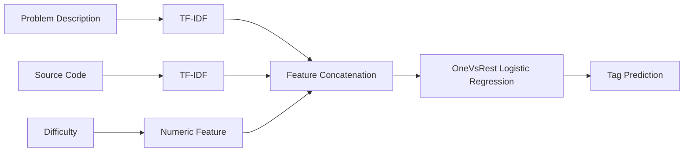

# Classification Multi-Labels (Tags)

Ce projet se présente comme un challenge de classification multi-label basé sur des exercices algorithmiques extrais de la plateforme Codeforme. 

### 1. Objectif : 

L'objectif est de prédire les tags associés avec un problème d'algorithme en utilisant :
- Description du problème
- Solution du code source
- Niveau de difficulté

Les tags cible sont : 
- math
- graphs
- strings
- number theory
- trees
- geometry
- games
- probabilities

### 2. Dataset : 

Le dataset est un sous-ensemble du dataset xCodeEval.

Après preprocessing : 
- 4982 problèmes algorithmiques
- Tâche de classification multi-label
- 8 target tags

Chaque échantillon contient : 
| Feature | Description |
|----------|-------------|
| description | Problem statement |
| code | Reference solution |
| difficulty | Problem difficulty |
| tags | Ground truth labels |


### 3. Structure du projet : 
```text
project/
│
├── data/
│   └── processed/
│       ├── processed_dataset.csv
│       ├── train.csv
│       └── test.csv
│
├── models/
│   ├── model_lgr.pkl
│   ├── model_svc.pkl
│   ├── mlb.pkl
│   ├── desc_vectorizer.pkl
│   └── code_vectorizer.pkl
│
├── src/
│   ├── config.py
│   ├── preprocessing.py
│   ├── split_dataset.py
│   ├── features.py
│   ├── model.py
│   ├── train.py
│   ├── evaluate.py
│   ├── predict.py
│   └── cli.py
│
└── README.md
```

### 4. Solution principale : 

Il est plosible de construire un modèle multi-input + multi-label avec possible fusion des plusieurs sources d'information. 
 - Feature engineering pour du texte
 - Feature engineering pour du code 
 - Modèle NLP pour chaque modalité
 - Fusion des deux modèles
 - Classifieur multi-label

## Méthodologie
### 1. Feature engineering : 
Trois sources d'informations sont utlisées : 
- __Prétraitement (text) :__ 
Au niveau de la description du problème nous avons : 
    - lowercase (rendre toutes les sentences en miniscule)
    - suppression stopwords (s'il y'en a - on verra dans la suite mdrr !!)
    - tokenisation très important pour un problème de NLP, je rigole, mais biensûr

- __Pour le code python :__ 

    Différentes features possibles à etudier et utiliser selon la pertinence. 
- __Difficulté :__ 
Pour la difficulté.

#### 1-1. Description du problème :
TF-IDF vectorization

```python
TfidfVectorizer(
    max_features=30000,
    ngram_range=(1, 2)
)
```
#### 1-2. Source Code
TF-IDF vectorization sur les tokens du code

```python
TfidfVectorizer(
    analyzer="word"
)
```
#### 1-3 Difficulté 
Caractéristique numérique ajouté aux matrix des caractéristiques finaux

### 2. Matrix des carractéristiques finaux
```text
Description TF-IDF
        +
Code TF-IDF
        +
Difficulty
        ↓
Sparse Feature Matrix
```

### 3. Modèle : 

Modèle de classification capable d'entrainer (soit fusion/concat) les modèles utilisés pour la __description__ et le __code__. Ce modèle sera un meilleur compromis sur la performance.

#### 3-1. Regression logistique : 
```text
OneVsRestClassifier(LogisticRegression)
```
#### 3-2. Linear SVC : 
```text
OneVsRestClassifier(LinearSVC)
```

### 4. Gestion le désiquilibre des classes : 
Les tags peuvent créer un gros problème de déséquilibre entre les classes. 

### 5. Evaluation : 
Métrics utilisées préferable, les métriques de l'ensemble F1 raisonnable pour un problème de classification et pour un problème multi-label.
Les méticques suivantes ont été utilisées : 
- Precision
- Recall
- F1-score
- Micro F1
- Macro F1

__NB :__ les métriques par tags ont aussi été utilisées.

### 6. Résultat 
#### 6-1. Regression logistique: 
| Tag | F1 Score |
|------|---------:|
| games | 0.815 |
| math | 0.793 |
| strings | 0.788 |
| geometry | 0.750 |
| graphs | 0.683 |
| trees | 0.573 |
| number theory | 0.570 |
| probabilities | 0.450 |

__Metriques globales :__
```text
Micro F1 = 0.7155
Macro F1 = 0.6773
```
#### 6-2. Linear SVC : 
```text
Micro F1 = 0.4750
Macro F1 = 0.1365
```
La __regression logistique__ sur-performe significativement sur le la __SVC lineaire__ et a été retenue comme le modele final.

## Usage 
### 1. Entraînement
```bash
python src/cli.py train
```
### 2. Evaluation 
```bash
python src/cli.py evaluate
```
### 3. Prediction
```bash
python src/cli.py predict \
    --description "Find the shortest path in a graph" \
    --code "vector<int> adj[n];" \
    --difficulty 1200
```

> Example de prediction : 
>```text
>Logistic Regression:
>['graphs']
>
>Linear SVC:
>['graphs', 'math']
>```

## Schéma pipeline : 


## Commandes bash : 
Se positionner sur la branche develop en local : 
```bash
python src/preprocessing
python src/features.py
python src/model.py
```
## Gestion de Projet : 

Pour réaliser le projet dans son entiereté, j'ai décidé de l'éxécuté selon la méthode de gestion de projet repartis sur les tâches et le temps.

## Conclusion 
Un pipeline de classification multi-label basé sur les caractéristiques TF-IDF et Logistique regression a été developpé.

L'objectif global du modèle : 

__Micro F1 = 0.72__

tout en maintenant une faible latence d'inférence et une architecture simple et interprétable adaptée au déploiement en production.

