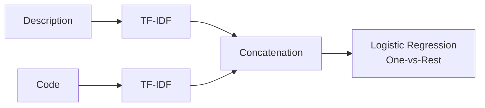

# Classification Multi-Labels (Tags)

### 1. Nature du problème : 

La nature du problème ici est : 
- Classification multi-label (un exercice peut avoir plusieurs tags)
-  Données hétérogènes:
    - __problem_description__ (texte naturel)
    - __source_code__ (python de prefèrence)
- 8 classes cibles (0 à 8) : ['maths', 'graphs', 'strings', 'number', 'theory', 'trees', 'geometry', 'games', 'probabilities'] 

### 2. Solution principale : 

Il est plosible de construire un modèle multi-input + multi-label avec possible fusion des plusieurs sources d'information. 
 - Feature engineering pour du texte
 - Feature engineering pour du code 
 - Modèle NLP pour chaque modalité
 - Fusion des deux modèles
 - Classifieur multi-label

### 3. Feature engineering : 
- __Prétraitement (text) :__ 
Au niveau de la description du problème nous avons : 
    - lowercase (rendre toutes les sentences en miniscule)
    - suppression stopwords (s'il y'en a - on verra dans la suite mdrr !!)
    - tokenisation très important pour un problème de NLP, je rigole, mais biensûr

- __Pour le code python :__ 

    Différentes features possibles à etudier et utiliser selon la pertinence.  

### 4. Modèle : 

Modèle de classification capable d'entrainer (soit fusion/concat) les modèles utilisés pour la __description__ et le __code__. Ce modèle sera un meilleur compromis sur la performance.

### 5. Gestion le désiquilibre des classes : 
Les tags peuvent créer un gros problème de déséquilibre entre les classes. 

### 6. Evaluation : 
Métrics utilisées préferable, les métriques de l'ensemble F1 raisonnable pour un problème de classification et pour un problème multi-label.PP

## Schéma pipeline : 

## Commandes bash : 
Se positionner sur la branche develop : 
>python src/preprocessing
